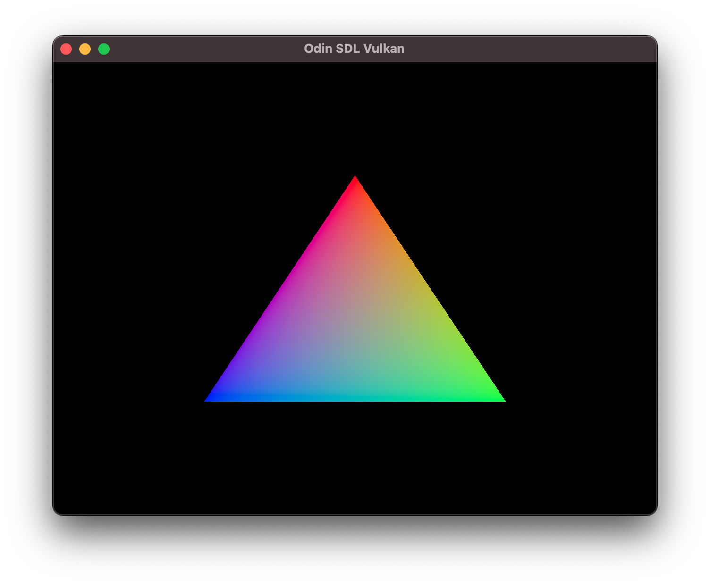

# odin-vulkan



[Vulkan Tutorial](https://vulkan-tutorial.com/)'s Drawing a triangle, but written in [Odin](https://odin-lang.org/), using SDL for window management instead of GLFW. Another difference is that the tutorial uses a single application class with methods using private members, but because Odin has no classes I've been a bit more explicit about what gets passed around to which procedure, which hopefully makes the procedures less opaque and easier to understand.

## Prerequisites

- odin
- SDL2
- VulkanSDK installed with `setup-env.sh` called, so the correct paths are in your environment, and `glslc` in your path for shader compilation.

## Development

```sh
./build-shaders.sh && odin run . -debug
```
